# Trabajo final: Resolución de un problma, caso y/o supuesto práctico

>**Alumno: Juan Antonio Villegas Recio**
>
>**Diseño de Interfaces de Usuario**
>
>**Curso 2020/2021**
>
>**Universidad de Granada**

## Parte I: Mi experiencia UX

En este curso, gracias a las diversas actividades de clase y sobre todo a las [prácticas](https://github.com/Mapachana/DIU21), he podido ganar mucho en conocimientos sobre el diseño UX. Personalmente, el área orientada al diseño en aplicaciones y páginas web es un entorno en el que nunca antes había trabajado, no sabía nada serio acerca de ello más allá de la propia intuición personal de cuándo un diseño "queda bien" o una página es "fácil de navegar". Aunque tengo que reconocer que no esperaba que este área fuera tan profunda y existiera tal cantidad de técnicas previas al propio diseño.

Durante las clases teóricas se han realizado numerosas actividades prácticas en grupos. Sinceramente, los primeros días de clase era muy reacio a estas actividades, pero con el paso del tiempo entendí que eran la parte más importante de la clase, ya que es cuando realmente ponemos en práctica lo aprendido. Respecto a prácticas, las primeras fases del curso se trataban más de examinar y valorar otras páginas web para hacernos una idea de qué se debe y qué no se deba hacer, algo así como "¿Cómo tiene que ser esta web para que yo me sintiera a gusto navegando por ella?","¿Qué cambiaría?","¿Qué elementos me parecen suficientemente buenos como para añadirlos a mi aplicación?". 

Seguidamente nos centramos más en la **experiencia de usuario** y en el **factor humano**. Pienso que es muy importante tener controlado este aspecto porque realmente toda esta disciplina se centra en el usuario, en la persona que maneja mi aplicación, por lo que no tendría sentido desarrollar una aplicación sin tener en cuenta la variedad de usuarios que van a utilizarla. Sin embargo, me he dado cuenta de que es imposible hacer una aplicación acorde a todo el mundo, irremediablemente siempre habrá colectivos que se sentirán más incómodos que otros en tu web. Realmente, es inevitable caer en ciertos estereotipos relacionados con el tema que trata la plataforma. Gracias a la [actividad de etnografía](https://github.com/JAntonioVR/Trabajo-Final-DIU/blob/main/actividades/Actividad_DIU%201%20-%20Etnografia.pdf) pude fijarme en problemas a evitar que puede causar la experiencia de usuario. En prácticas nos pusimos en la piel de dos **personas ficticias**: Amparo y Jorge, dos personas muy distintas con historias frustradas por la dificultad de las páginas web unidas a sus discapacidades. Gracias a ello consideramos un enfoque concreto para el futuro de nuestra aplicación: Letra e iconos suficientemente grande para que se pueda leer y ver bien todo y preocupación por el turismo accesible.

Utilizando lo aprendido, realizamos algunas actividades como son la **malla receptora de información**, el **mapa de empatía** o el "**Scope Canvas**", que nos ayudaron a realizar una primera aproximación de la idea a desarrollar. Realmente, a mí me sirvió para ordenar, esquematizar y clasificar las ideas que se me iban ocurriendo. Teniendo en cuenta estos métodos podría empezar a desarrollarse una aplicación.

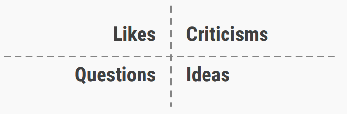

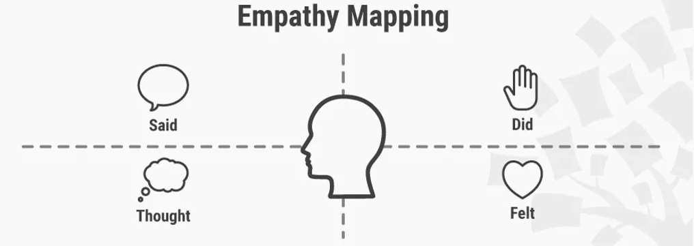

A continuación, ya con el esquema hecho en la cabeza, se diseñaría el "**Wireframe**" de la aplicación. Muy útil, pues aunque no es nada formal, se puede utilizar como borrador, como esqueleto de la aplicación, estando sujeto a grandes cambios en una fase muy temprana del desarrollo. 

Lo siguiente fue aplicar técnicas como el "**Moodboard**", que me pareció especialmente útil y divertido. Recuerdo hacer un moodboard orientado a una tienda que vendía comida con insectos. No es un tema agradable en general y de hecho a mí me producía cierta repulsión, pero debo reconocer que hicimos un gran trabajo, que hizo incluso plantearme si yo podría navegar o interesarme en una página así, aún siendo de insectos. Esto me hizo comprender que un buen diseño puede hacerte plantearte cualquier cosa, incluso si te comerías un bicho. Quería transmitir esa misma sensación en la moodboard de las prácticas.

En prácticas hicimos énfasis en colores relacionados con los mosaicos de la Alhambra, imágenes inspiradoras, fuentes, y una distribución con poco texto que diera una idea del diseño. Posteriormente diseñamos una "**Landing Page**" utilizando el estilo predefinido en la moodboard. Personalmente pienso que hicimos un trabajo llamativo que junto con las imágenes daba la sensación que deseábamos. Personalmente, creo que me habría descargado la app. La idea de todo esto era dar una buena primera impresión.

Seguidamente aprendimos a identificar patrones de diseño, muy importantes, pues son opciones muy estandarizadas y útiles en el diseño, y al ser estandar, en general los usuarios saben manejarlas. Esta actividad en clase de teoría no llegué a entenderla demasiado bien, aunque en prácticas hice mucho más énfasis y entendí bastante bien el trasfondo de esta idea.

Posteriormente llegamos a lo que para mí fue el momento álgido de la asignatura: el diseño de un "**Mockup**". En clase de teoría hicimos un breve caso de estudio sobre el restaurante [El Higo](https://es-es.facebook.com/ElHigoGranada).  En prácticas aplicamos los patrones, colores, imágenes, tipografías, etc. al wireframe y diseñamos lo que creemos que era nuestra aplicación ideal (a grandes rasgos).  Estas dos actividades sirvieron para aplicar criterios muy distintos a plataformas muy distintas, ver las posibles diferencias, adaptarse y buscar un buen diseño que transmita y sea útil en la navegación.

  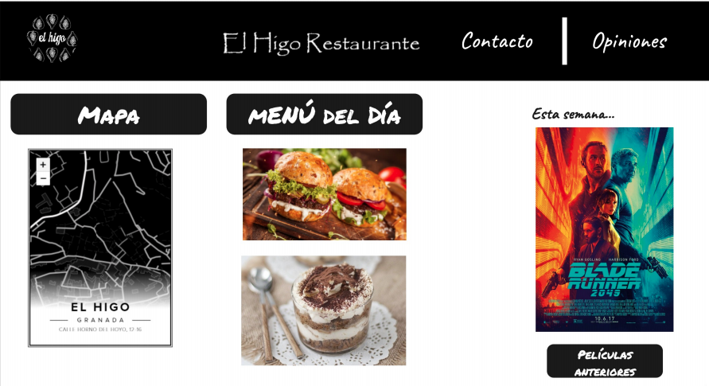
  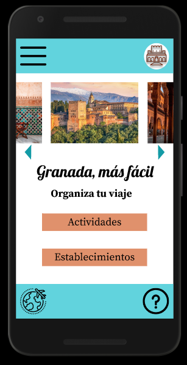 

Por último, en la última práctica, evaluamos conforme a la **usabilidad** nuestra propia página y la de otros compañeros. No solo nosotros, también otras dos personas ajenas a la asignatura. Con esto pudimos evaluar de manera objetiva nuestra página y otras, ya que realmente, siendo sinceros se suele ver con mejores ojos el trabajo propio que el ajeno, pero al utilizar personas ajenas pudimos obtener una opinión neutral, y así confirmar que hicimos un buen trabajo.

Ya para finalizar realizamos actividades sobre usabilidad y **accesibilidad**. En la [actividad de usabilidad](https://github.com/JAntonioVR/Trabajo-Final-DIU/blob/main/actividades/Actividad_DIU%202%20-%20Usabilidad.pdf) evaluamos algunas páginas web de universidades andaluzas. Yo elegí la [UCO](http://www.uco.es/), la [UMA](https://www.uma.es/#gsc.tab=0) y la [UGR](https://www.ugr.es/), y pude de nuevo observar, aunque ahora con un criterio mucho mayor que al principio del curso, muchos defectos en todas ellas, aunque también algunas cosas buenas. Aprovecho para decir que, en efecto, me recordó mucho a las primeras fases del curso, pero ahora tenía un criterio y un conocimiento mucho mayor, por lo que pude identificar rápidamente lo que antes me costaba mucho, y además podía pensar soluciones. Por ejemplo, la UMA tenía un menú desplegable exageradamente grande, y es algo que cambiaría utilizando un patrón de diseño que clasifique las diversas opciones en subpáginas fáciles de acceder, pero siempre con un enlace directo a home para que el usuario no se pierda al navegar por la página nada más entrar. Sobre la accesibilidad, la [actividad de accesibilidad](https://github.com/JAntonioVR/Trabajo-Final-DIU/blob/main/actividades/Actividad_DIU%203%20-%20Accesibilidad.pdf) consistía en utilizar herramientas que simulaban discapacidades de distinto tipo (unidas a que soy daltónico) y hacer algunas actividades en la web de un ayuntamiento, personalmente elegí el [Ayuntamiento de Granada](https://www.granada.org/). Debo aplaudir a la gente que vive con discapacidades visuales como la que simulé, porque no veía nada, tuve que bajar la intensidad y aún así me costaba. Aprendí a tener en cuenta que hay mucha gente con problemas de este tipo y hay que tenerlas en cuenta para abarcar más público y también por humanidad, todo el mundo tiene derecho a usar nuestra página. 

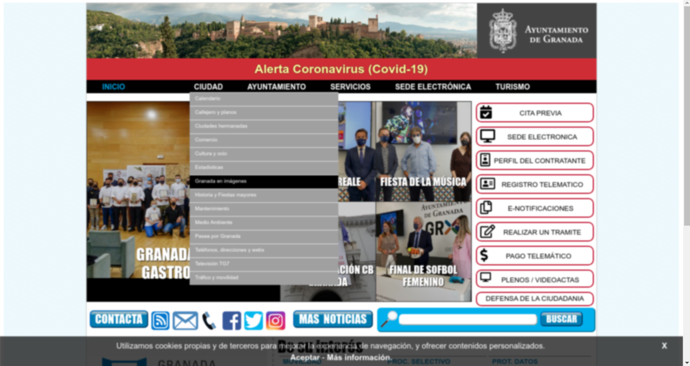

En conclusión, ahora conozco diversas técnicas orientadas al diseño y muchos factores a tener en cuenta a la hora de tratar este tema. Me ha servido de mucho esta asignatura, así que vamos a poner en práctica lo aprendido. 

## PARTE II: Caso de estudio. Web YUZIN

Seguiremos una estructura similar a las prácticas pero de manera simplificada. Para ello primero haremos un análisis de la versión actual de la página, destacando sus aspectos buenos y malos, para después hacer propuestas de mejora e implementar un nuevo diseño.

### Desk research: Análisis de la versión existente

Tras navegar durante un rato por la página, buscando defectos y virtudes, he sacado algunas conclusiones acerca de la actual versión de la página.

En primer lugar, respecto al diseño, hay varias carencias. El menú se sitúa a la derecha del logo, en una caja de color amarillo que llama la atención por lo mal colocada que está. Si bien es cierto que es responsiva la página, pero se adapta de una forma muy fea, adjunto ejemplos:

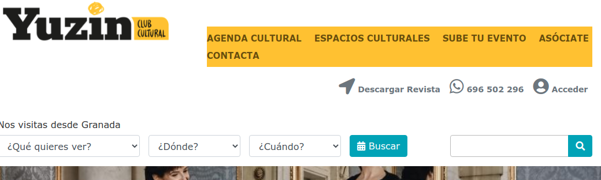

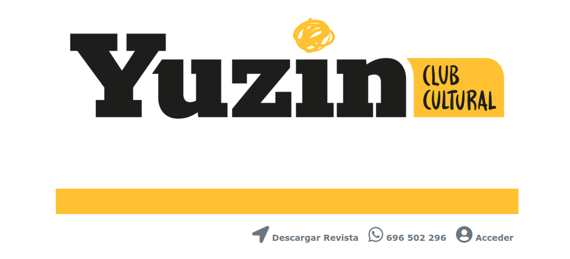

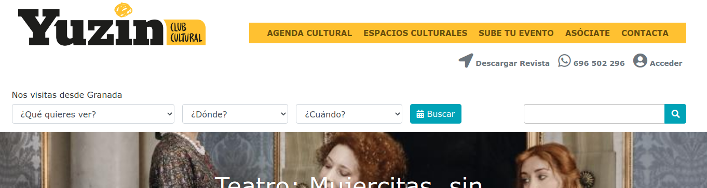

Como se puede observar, en la segunda ni siquiera aparece el menú principal. En móvil, más de lo mismo, se nota que no tienen como tal versión para móvil y le ceden el trabajo a la herramienta que hayan utilizado, que me atrevería a decir que han usado bootstrap incluso. 

Por otro lado, el número de teléfono en una zona tan visible no es recomendable, y además no es necesario incluirlo cuando existe una página de contacto. Además, aparentemente es un enlace, pero al pulsar no hace nada. El buscador por otro lado es muy intuitivo y funciona bastante bien. Creo que está en un lugar correcto, pues podría ocurrir que una persona llegue a Yuzin queriendo buscar qué ver en las ciudades de Granada o Sevilla en fechas concretas, y eso es justo lo que hace el buscador. Aunque hay un poco de ambigüedad entre el buscador de eventos y el buscador por palabras, quizá se debería relegar el buscador por palabras a un lugar más secundario o incluir alguna frase para captar la atención. Cabe destacar también que usan hasta 13 colores distintos que no terminan de combinar bien, creo que son demasiados y muy distintos. Sobre las fuentes, solo en las imágenes arriba adjuntas se aprecian 5 fuentes distintas, pienso que también son demasiadas. En conclusión, se debería reducir la cantidad de colores y fuentes y unificar más.

La web en su nueva versión no ha perdido la esencia de descargar el boletín mensual, añadiendo una suscripción al newsletter. Aunque creo que la web de descarga es poco intuitiva, suerte que no tiene demasiadas opciones, pero de primeras al entrar no sabía donde había que darle para descargar la revista, cuando ese debería ser el gran atractivo de esta pantalla. Por otro lado, me extraña que sólo se pueda consultar el boletín actual pero no los anteriores, ya que están creados, se podría tener un repositorio de números anteriores para que quien quiera consultar información de hace años pueda acceder a la página. 

Respecto a la navegabilidad, la suerte es que es muy sencilla la página, por lo que es difícil perderse, aunque se agradecería un botón de vuelta a home, aunque para eso está el logo, pero igual una persona con poca experiencia en web no se da cuenta. Un aspecto importante que habría que solucionar es que he probado a registrarme/suscribirme y no funciona la página. Al intentar acceder no existe la posibilidad de registrarse, sólo de inciar sesión. Pensé entonces que quizá había que suscribirse previamente, pero fui a la página de suscripción y al seleccionar una de las opciones me llevaba a la misma página, sin ningún feedback ni ningún formulario de registro, desistí. Tampoco tiene opción de traducirse al inglés, muy necesaria en webs relacionadas de alguna forma con el turismo.

Hablando de suscripciones, ¿qué necesidad hay de presentar cuatro opciones iguales como si fueran distintas? Realmente todos los planes ofrecen lo mismo a precios y plazos distintos, pero leí la información cuatro veces pensando que algún plan cambiaría, pero no.

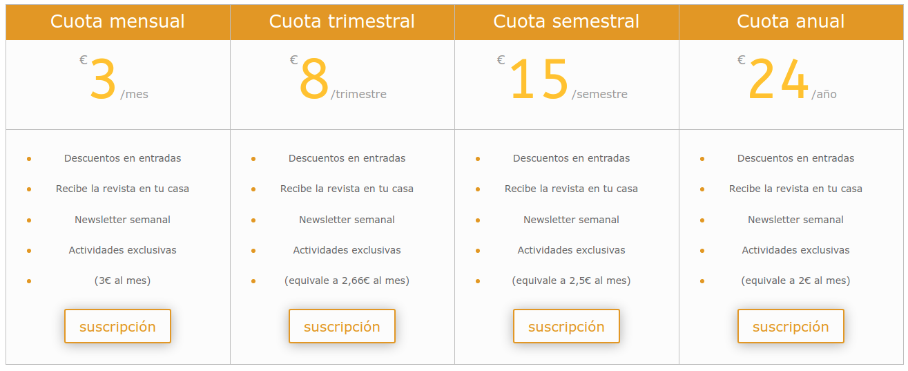

Hablemos ahora del footer, es tan grande que cabe una imagen entera del logo ampliada. No es necesario que sea tan grande, ya que incluye enlaces a las mismas páginas que el menú, la ayuda que debería tener una página propia y opción de suscripción a la newsletter, que no pienso que sea el lugar correcto para posicionar este aspecto.

Pese a todo ello, la web es sencilla, intuitiva y cumple con su función, aún así muchas cosas pueden mejorarse, como veremos.

### Ideación

Con el objetivo de sintetizar la información anteriormente expuesta, he realizado una malla receptora de información, colocando cada crítica, idea, pregunta o virtud en su lugar, desde el punto de vista de usuarios y de desarrolladores.

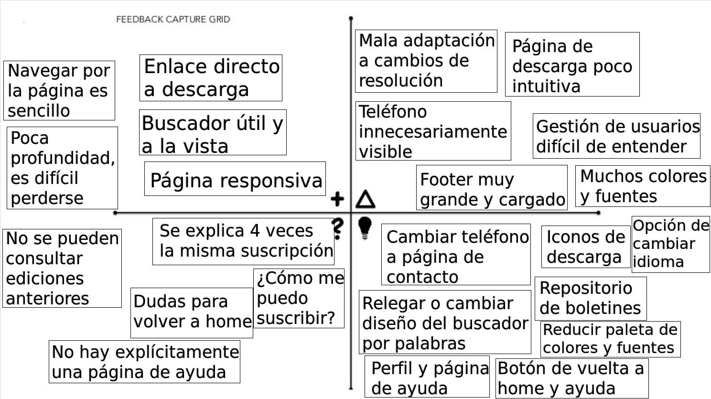

### Wireframe

Ya con las ideas clasificadas y teniendo en cuenta todos los aspectos que he sintetizado, diseñé a papel algunos wireframes, que posteriormente serán implementados. Se puede consultar un documento completo en [este enlace](https://github.com/JAntonioVR/Trabajo-Final-DIU/blob/main/archivos/wireframe.pdf), aunque adjunto algunas imágenes a continuación:

  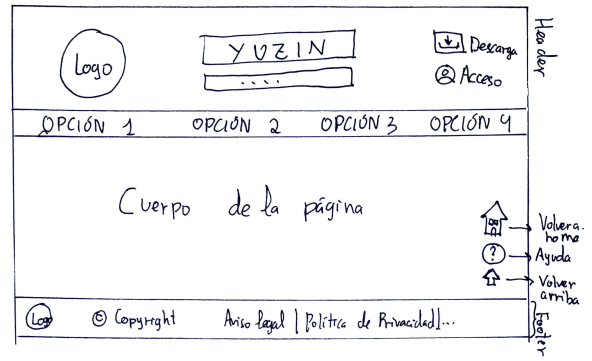
  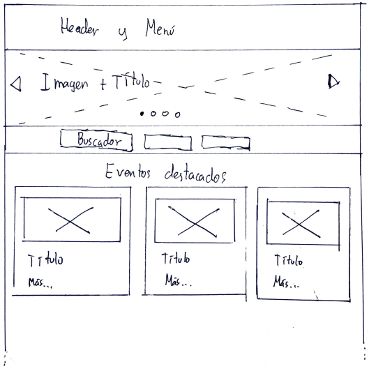
  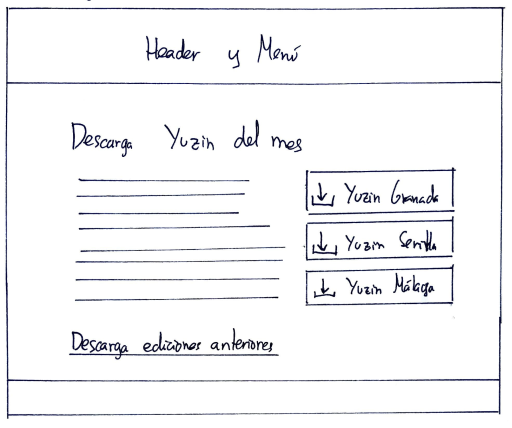

La primera imagen es una plantilla del encabezado y el pie de página que llevarán todas las pantallas. Así, se podrá acceder directamente al link de descarga del boletín actual desde cualquier parte y además será fácil de encontrar, respetando el estilo actual de la web y recordando el anterior. El footer será reducido considerablemente, conteniendo poca información y poco relevante. Además se incluirán botones de volver a home, enlace directo a la página de ayuda y opción de volver arriba que viajarán solidariamente con nosotros al hacer scroll. La pantalla principal se asemejará a la actual, aunque cambiaré la localización del buscador y pondré una galería de imágenes para añadir atractivo. La página de descarga es también similar a la actual pero con botones de descarga mucho más llamativos e intuitivos.  Además, se incluirá la posibilidad de descargar boletines anteriores. 

  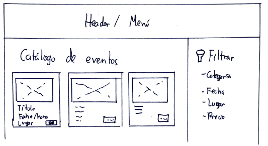
  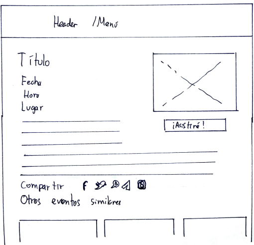

En estas dos páginas se expondrán eventos de manera simplificada, incluyendo los datos básicos como son el nombre, fecha, hora, lugar y precio de la actividad. Se incluirá un filtro atendiendo a varios criterios para poder ver sólo los que se adapten a nuestros deseos y necesidades. Al pulsar sobre uno de estos eventos nos lleva a la segunda página, la página principal de eventos, que incluye la misma información que la versión actual pero de forma más visual y mejor organizada. Se incluye además la opción de elegir asistir a este evento, y si se pulsa se quedará esta actividad guardad en nuestro perfil. Existirán pantallas de espacios culturales análogas a las de eventos.

  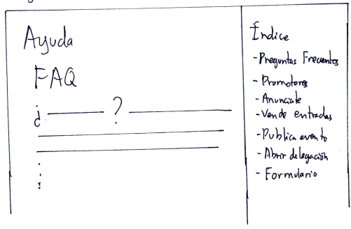
  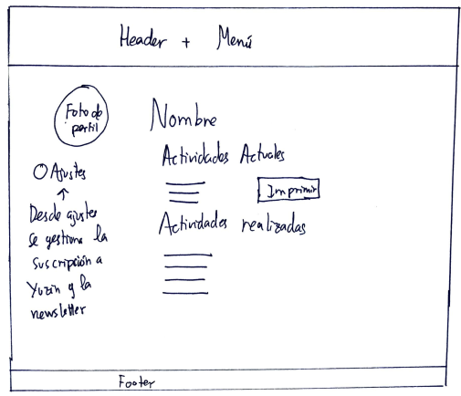

Se va a incluir una propia página de ayuda, con un índice que nos ayude a encontrar justo lo que necesitamos. Gracias a esta pantalla de ayuda podemos liberar el footer. Además se incluirá para los miembros de Yuzin una página de su perfil, desde la cual podrán gestionar las actividades que han guardado para poder imprimir un sumario, consultar actividades ya realizadas y gestionar su suscripción tanto a Yuzin como a la newsletter.

Además de estas que aquí se presentan, se implementarían páginas de contacto, de subir evento, login, unirse a Yuzin, etc. No han sido incluidas porque los cambios han sido poco relevantes, pero se pueden consultar en el [archivo PDF](https://github.com/JAntonioVR/Trabajo-Final-DIU/blob/main/archivos/wireframe.pdf) subido.

### Moodboard

Una vez desarrollados algunos wireframe, toca darle color y emoción al proyecto. Con esta premisa, he diseñado un moodboard donde incluyo algunas imágenes de actividades ofertadas en la web, un logo diseñado en [brandmark.io](https://brandmark.io/), una paleta de colores inspirada en los colores del logo (que a su vez están inspirados en algunos eventos de la página) y tres fuentes que pienso pueden encajar en el concepto. Se adjunta un [documento PDF](https://github.com/JAntonioVR/Trabajo-Final-DIU/blob/main/archivos/moodboard.pdf) y una [imagen PNG](https://github.com/JAntonioVR/Trabajo-Final-DIU/blob/main/img/moodboard.png).

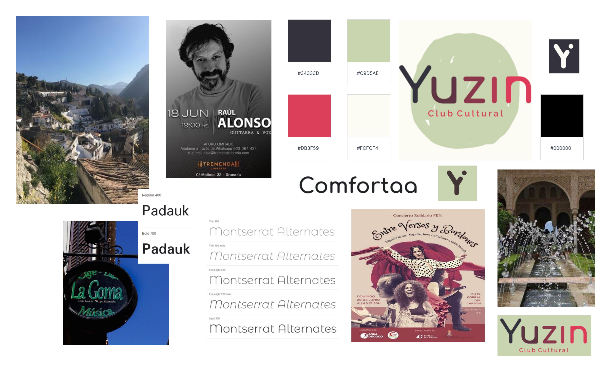

 ### Mockup

Una vez tenemos las tipografías, colores, logos, iconos e imágenes, procedemos a diseñar el mockup. En general, he sido fiel a los wireframe, aunque he cambiado algunas cosas. Por ejemplo, la localización del botón de apuntarse a una actividad o la inclusión en home de un botón para cambiar el idioma. Se han implementado la mayoría de pantallas que se incluyen en el wireframe.

Para consultar los mockup, que han sido realizados con la herramienta [Figma](https://www.figma.com/), pinche en el siguiente [enlace](https://github.com/JAntonioVR/Trabajo-Final-DIU/blob/main/archivos/mockup.pdf).

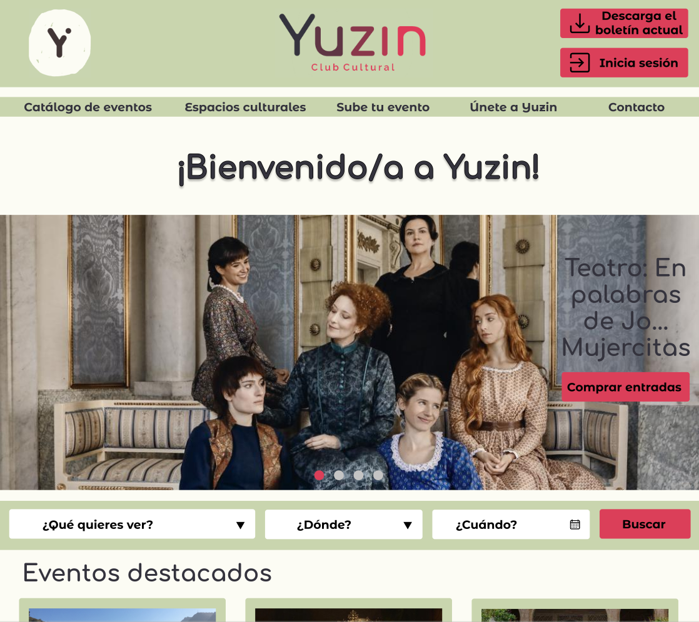

En el desarrollo del mockup se ha usado íntegramente la paleta de colores elegida en el moodboard, con colores suaves para los fondos y los cuadros y más vivo para los botones que queremos que sean llamativos. Además se ha establecido que la opción "Únete a Yuzin" solo aparece cuando el usuario no está registrado, en caso de estarlo aparecerá "Mi Perfil". 

### Conclusiones

Usando técnicas y recursos aprendidos durante este cuatrimestre en esta asignatura, he podido hacer un análisis intensivo a una web, examinar sus defectos y virtudes, organizarlos en mi cabeza y desarrollar un rediseño. Se le ha dado un cambio de imagen muy notable a [Yuzin.com](yuzin.com), manteniendo las cosas buenas que tenía, como los diseños de algunas páginas, el formulario o la navegación sencilla y se han corregido otros aspectos no tan buenos como el exceso de fuentes y colores o el mal diseño de la pantalla de descarga. En definitiva, estoy satisfecho con lo aprendido y sobre todo con lo puesto en práctica en este caso de estudio.

## Referencias

* UX Toolkit https://mgea.github.io/UX-DIU-Checklist/index.html

* Feedback Capture Grid https://public-media.interaction-design.org/pdf/Feedback-Capture-Grid.pdf

* Empathy Map https://www.interaction-design.org/literature/article/empathy-map-why-and-how-to-use-it

* Scope Canvas http://scopecanvas.com/

* Logo: https://brandmark.io/

* Moodboard: https://milanote.com/

* Mockup: https://www.figma.com/

* 
Icons made by:
	<ul>
	<li> <a href="https://www.flaticon.com/authors/pixel-perfect" title="Pixel perfect">Pixel perfect</a> </li>
	<li> <a href="https://www.flaticon.com/authors/kiranshastry" title="Kiranshastry">Kiranshastry</a></li>
	<li> <a href="https://www.flaticon.com/authors/dmitri13" title="dmitri13">dmitri13</a> </li>
	<li> <a href="https://www.flaticon.com/authors/those-icons" title="Those Icons">Those Icons</a></li>
	<li> <a href="https://www.freepik.com" title="Freepik">Freepik</a> </li>
	<li> <a href="https://www.flaticon.com/authors/smashicons" title="Smashicons">Smashicons</a> </li>
	<li> <a href="https://www.flaticon.com/authors/vitaly-gorbachev" title="Vitaly Gorbachev">Vitaly Gorbachev</a> </li>
	<li> <a href="https://www.flaticon.com/authors/roundicons" title="Roundicons">Roundicons</a> </li>
	<li> <a href="https://www.flaticon.com/authors/bqlqn" title="bqlqn">bqlqn</a> </li>
	from <a href="https://www.flaticon.com/" title="Flaticon">www.flaticon.com</a></li>
	</ul>

